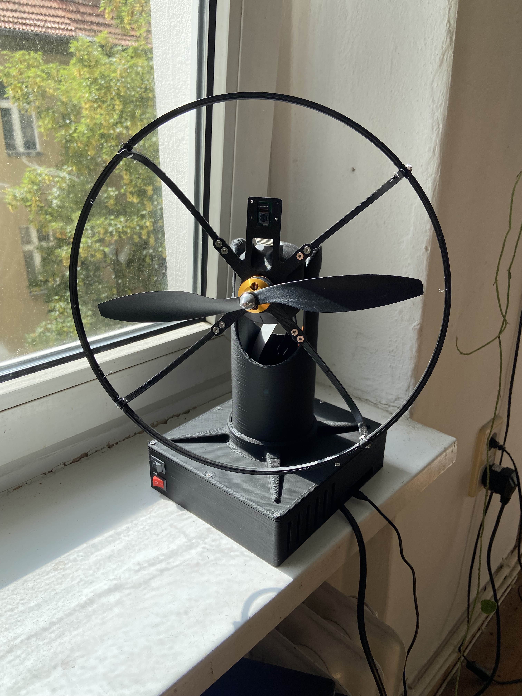

# Face Following Fan

This project uses object detection (in this case face detection) to follow an object around the room and blow on it using pan and tilt motion.

This is a work in progress. It is both incredibly dangerous and horrendously impractical. That is exactly why I made it.

## List of Parts

* Raspberry Pi 3b+
* Raspberry Pi Camera v2
* [PCA9685 Servo driver](https://www.ebay.de/itm/253285067342)
* [12V to 5V Buck converter](https://www.amazon.de/gp/product/B07RGB2HB6)
* [12V/10A generic power supply](https://www.amazon.de/gp/product/B01LLFEMQ0)
* [A2212 Brushless Motor with propellers and speed controller](https://www.amazon.de/gp/product/B081CW2928)
* 2x [MG996R Servos](https://www.amazon.de/gp/product/B088NJRFD7)
* 2x 240V/6A Switches
* A bunch of small screws
* Lots of 3D prints

## Concept of Operation

This project uses a [custom output](https://picamera.readthedocs.io/en/release-1.12/recipes2.html#custom-outputs) to efficiently capture full-frame, low resolution greyscale images from a Raspberry Pi Camera v2 (more information [here](https://raspberrypi.stackexchange.com/a/58941/64647)).
After capture, the image is processed by a Haar cascade (model available [here](https://github.com/opencv/opencv/blob/master/data/haarcascades/haarcascade_frontalface_default.xml)), configured to return a bounding box containing the "largest" face.
The coordinates of the centre of that bounding box are calculated, and if the face is far enough from the centre of the image, the servos will adjust their positions to aim the fan directly at the face.
Each loop takes under 0.06 seconds.
